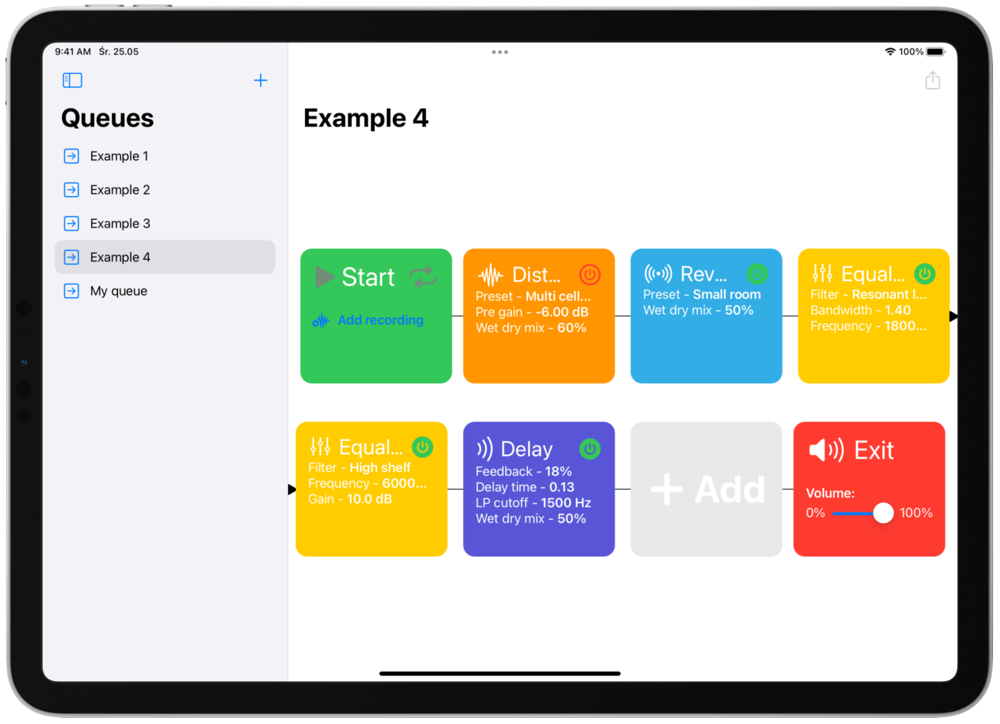
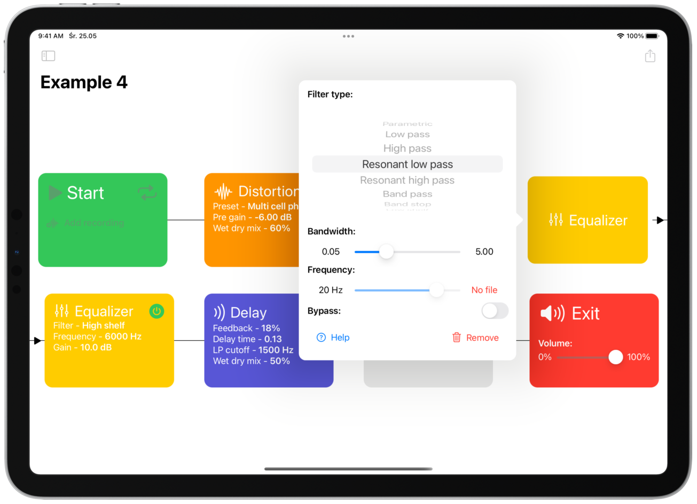
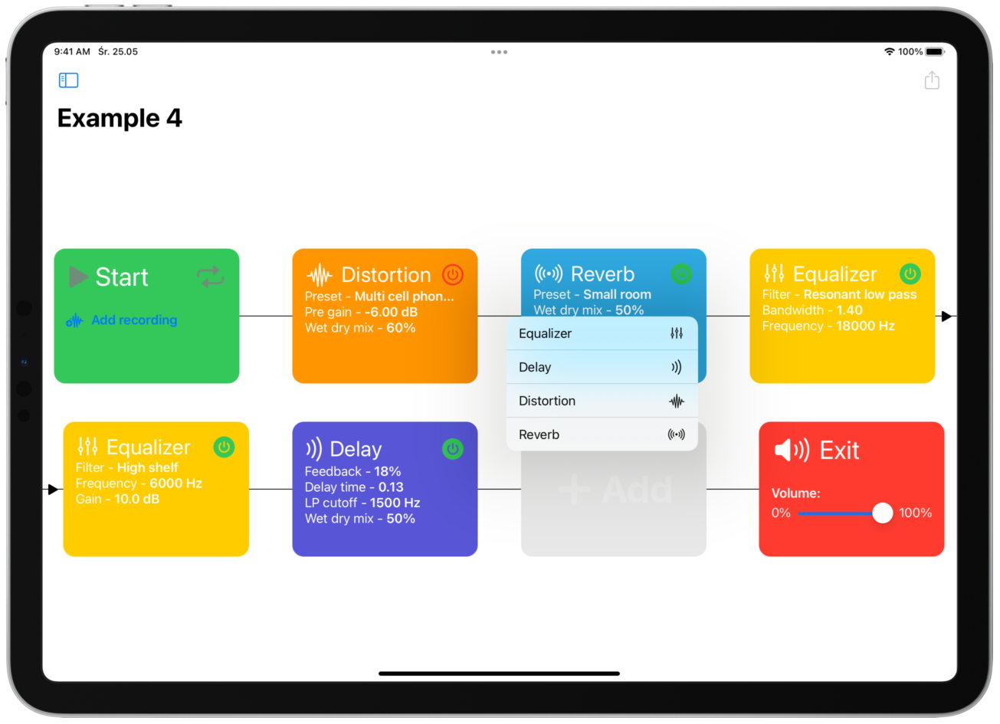

# Audioqe - WWDC22 submission

**Audioqe** is a simple audio processing app which allows users to create “**queues**” of audio effects. Its main purpose is to show the **impact of effects** in different combinations on a **sound**. It also gives users the way to quickly and effortlessly **apply their favourite combinations** to their recordings. Users can choose from **reverbs**, **distortions**, **delays** and **equalisers**. Each one can be dragged freely to **change the order** of applied effects. Each effect has a bunch of **settings** making it easy to **personalize it**. Users can **import** their own **audio files** for processing or use a **built in recorder**. Each queue is **automatically saved** and can be later reused with different audio files.

    

    

    

